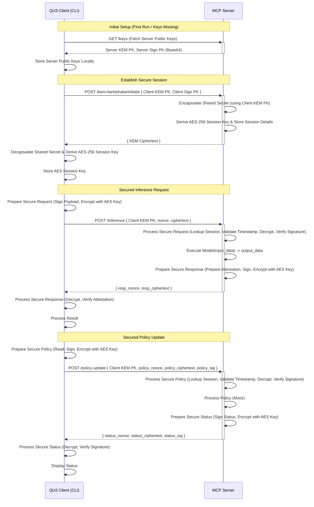
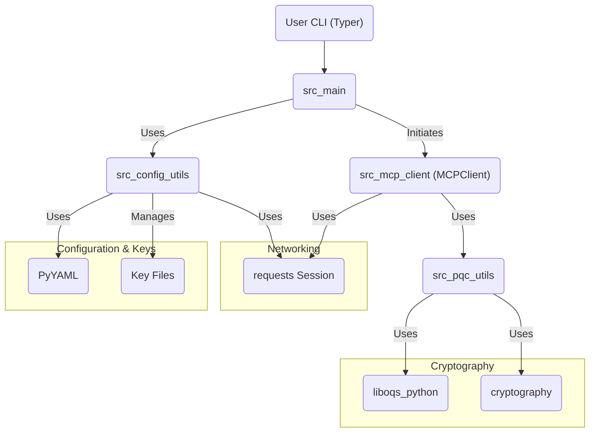
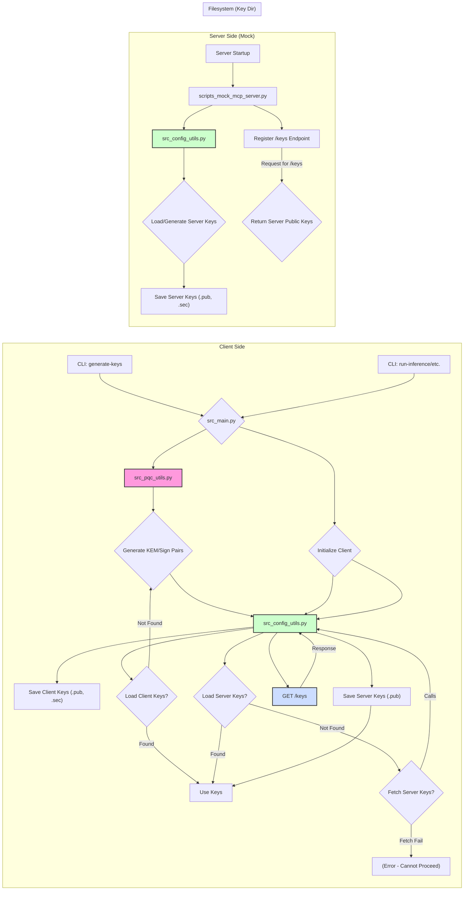

# QU3 - Quantum-Safe MCP Client

This project provides a client application (`qu3-app`) for secure interaction with Quantum-Safe Multi-Compute Provider (MCP) environments. It leverages post-quantum cryptography (PQC) standards for establishing secure communication channels, ensuring client authenticity, and verifying server attestations.

This client is designed to work with MCP servers that support the QU3 interaction protocols. For development and testing, a compatible mock server implementation is included in `scripts/mock_mcp_server.py`.

## Architecture & Flow

### Secure Communication Flow

The following diagram illustrates the end-to-end secure communication pattern implemented between the QU3 Client and the MCP Server:



### Client Component Interaction

This diagram shows how the main Python modules within the client application interact:



### Key Management Overview

Keys are crucial for the security protocols. Here's how they are managed:



## Core Components

*   **`src/main.py`**: Command-line interface (CLI) built with Typer. Handles user commands, orchestrates client operations, and displays results. Includes commands for key generation, inference, agent workflows, and policy updates.
*   **`src/mcp_client.py`**: The main client class (`MCPClient`) responsible for:
    *   Managing PQC keys.
    *   Defining request (`MCPRequest`) and response (`MCPResponse`) data structures.
    *   Establishing secure sessions via KEM handshake (`connect`).
    *   Sending signed and encrypted requests (`send_request`).
    *   Processing and verifying encrypted/signed responses.
    *   Handling disconnection (`disconnect`).
*   **`src/pqc_utils.py`**: Utility functions for PQC operations (Kyber KEM, SPHINCS+ signing) using `liboqs-python`, AES-GCM encryption/decryption using `cryptography`, and HKDF key derivation.
*   **`src/config_utils.py`**: Handles loading configuration from `config.yaml`, loading/saving keys from/to files, and fetching server public keys from the `/keys` endpoint.
*   **`scripts/mock_mcp_server.py`**: A FastAPI development/test server that simulates an MCP environment. Implements the server-side logic for KEM handshake, request decryption/verification, basic model execution, attestation signing, response encryption, policy updates, and key distribution.
*   **`config.yaml`**: Configuration file for storing settings like the default key directory (`key_directory`) and server URL (`server_url`).
*   **`tests/`**: Directory containing unit tests (`unittest`) for core components (`pqc_utils`, `config_utils`, `mcp_client`).

## Features

*   **PQC Algorithms**: Uses NIST PQC finalists:
    *   KEM: `Kyber-768`
    *   Signature: `SPHINCS+-SHA2-128f-simple`
*   **PQC Key Management**: Generates and loads Kyber and SPHINCS+ key pairs.
*   **Secure Session Establishment**: Uses Kyber KEM over a network handshake (`/kem-handshake/initiate`) to establish a shared secret.
*   **Key Derivation**: Derives a 32-byte AES-256 key from the KEM shared secret using HKDF-SHA256.
*   **Encrypted Communication**: Encrypts request/response payloads (after KEM handshake) using AES-256-GCM with the derived session key.
*   **Client Authentication**: Client signs requests using SPHINCS+; server verifies.
*   **Server Attestation**: Server signs responses (attestation data) using SPHINCS+; client verifies.
*   **Configuration**: Loads key directory and server URL from `config.yaml`.
*   **Automated Server Key Fetching**: Client automatically fetches server public keys from the `/keys` endpoint if not found locally.
*   **CLI Commands**:
    *   `generate-keys`: Creates client key pairs.
    *   `run-inference`: Sends a single, secured inference request.
    *   `run-agent`: Executes a sequential workflow (`modelA->modelB`), passing outputs as inputs (wraps non-dict output), with step-by-step reporting and robust failure handling.
    *   `update-policy`: Sends an encrypted and signed policy file to the server.
*   **Mock Server**: Includes endpoints (`/`, `/keys`, `/kem-handshake/initiate`, `/inference`, `/policy-update`) implementing the corresponding server-side PQC and communication logic for testing. Provides example models `model_caps` and `model_reverse`.
*   **Unit Tests**: Includes unit tests covering core cryptographic utilities, configuration management, and client communication logic (with network mocking).

## Setup

1.  **Clone the repository:**
    ```bash
    git clone <repository_url>
    cd qu3-app
    ```
2.  **Create a virtual environment:**
    ```bash
    python3 -m venv venv
    source venv/bin/activate
    ```
3.  **Install dependencies:**
    ```bash
    pip install -r requirements.txt
    ```
    *(Note: `liboqs-python` might require system dependencies like a C compiler and the `liboqs` C library. Refer to its documentation if installation fails.)*
4.  **(Optional) Configure `config.yaml`:** Modify `key_directory` or `server_url` if needed. The default key directory is `~/.qu3/keys/`.

## Running the Mock Server

In one terminal, run:

```bash
# Ensure virtual environment is active
source venv/bin/activate

python -m scripts.mock_mcp_server
```

The server will start (usually on `http://127.0.0.1:8000`) and automatically generate its own key pairs in the configured key directory if they don't exist.

## Running the Client CLI

In another terminal (with the virtual environment activated):

1.  **Generate Client Keys:** (Only needs to be done once unless `--force` is used)
    ```bash
    python -m src.main generate-keys
    ```

2.  **Fetch Server Keys (Automatic):** The client will attempt to fetch keys from the server's `/keys` endpoint during initialization (`run-inference`, `run-agent`, `update-policy`) if `server_kem.pub` and `server_sign.pub` are not found in the key directory specified in `config.yaml`. Ensure the mock server is running before executing client commands that require connection.

3.  **Run Single Inference:**
    ```bash
    # Example using mock server's model_caps
    python -m src.main run-inference model_caps '{"text": "process this data"}'

    # Example specifying server URL
    python -m src.main run-inference model_reverse '{"text": "backward"}' --server-url http://127.0.0.1:8000
    ```

4.  **Run Agent Workflow:**
    ```bash
    # Example chaining two mock models
    python -m src.main run-agent "model_caps -> model_reverse" '{"text": "flow start"}'
    ```

5.  **Update Policy:**
    Create a policy file (e.g., `my_policy.txt`) with some content.
    ```bash
    echo "Allow model_caps access." > my_policy.txt
    python -m src.main update-policy --policy-file my_policy.txt
    ```

## Running Tests

To run the unit tests:

```bash
# Ensure virtual environment is active
source venv/bin/activate

python -m unittest discover tests
```

Or run specific test files:

```bash
python -m unittest tests.test_pqc_utils
python -m unittest tests.test_config_utils
python -m unittest tests.test_mcp_client
```
